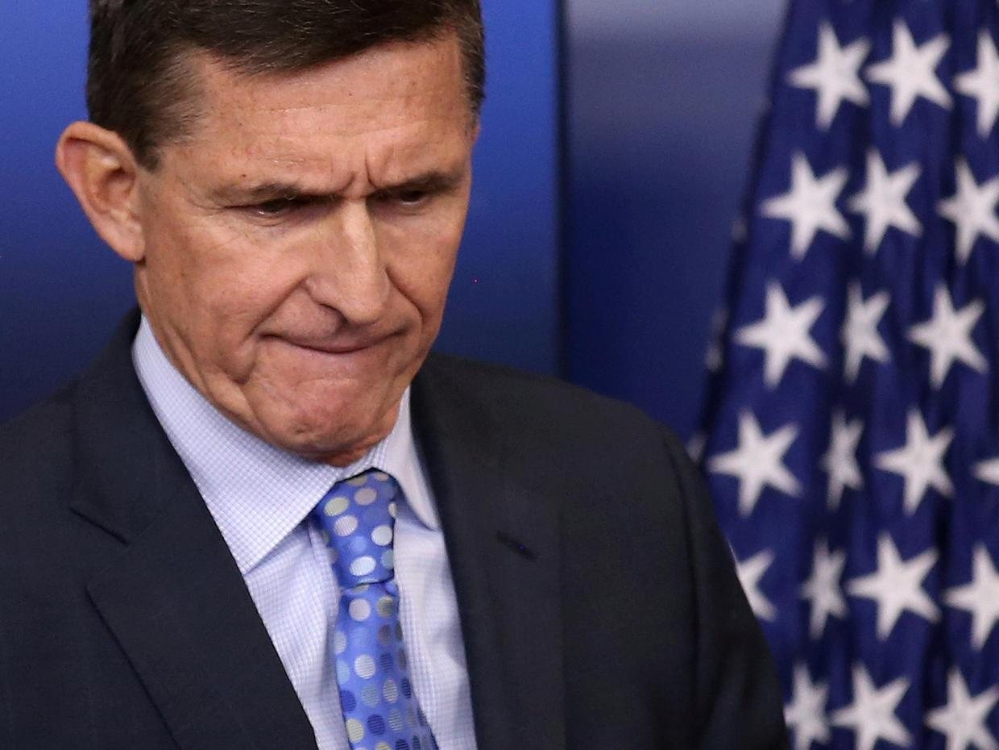

# Michael Flynn did not disclose income from Russian companies, White House forms show

Michael Flynn is the former national security adviser to Donald Trump. Here is a bit more information about him from [this new article: ](http://www.independent.co.uk/news/world/americas/michael-flynn-national-security-adviser-donald-trump-white-house-financial-disclosure-russian-income-a7662521.html)

> "His lawyer has requested immunity from prosecution for his client if he testifies before the Senate and House intelligence committees. The request has reportedly been rejected."

The discrepancy could add to the legal battle Mr Flynn is about to face as he is due to testify before the Senate about his links to Russia and whether there was any collusion between the country and Trump aides to propel Mr Trump into the White House.

Here is more facts about him in this Russia scandal
<ul>
	<li>Mr Flynn was forced to resign after just 24 days in the job as he allegedly misled Vice President Mike Pence about his phone calls with Russian ambassador Sergei Kislyak before Mr Trump was in office.</li>
	<li>Mr Trump said the media treated his disgraced employee “very badly” and said Mr Flynn had not been let go due to calling the ambassador, but due to an erosion of "trust".</li>
	<li>He and Russian officials have flatly denied any collusion to tar Hillary Clinton. Mr Trump insisted Democrats are just sore over his win, and pointed to allegedly bias treatment of Ms Clinton's relationship with Russia.</li>
</ul>
